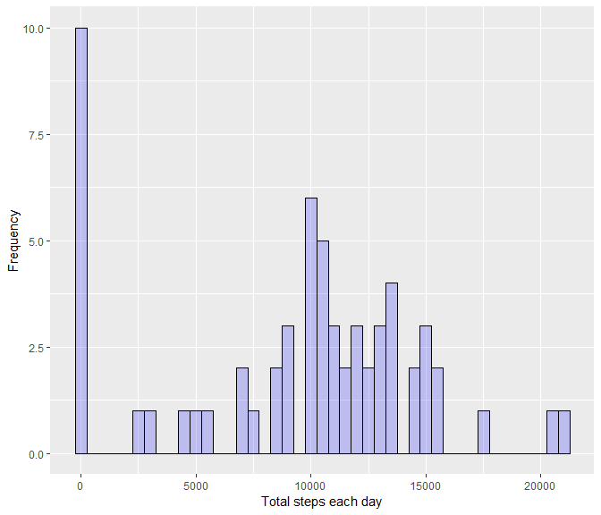

Reproducible Research: Project 1
================================

In this assignment, we analyse data of the number of steps taken over
two months in 5 minute intervals.

The data set can be found
[here](https://d396qusza40orc.cloudfront.net/repdata%2Fdata%2Factivity.zip).
I have stored this in my local working directory as activity.csv.

First I will load the relevant libraries needed.

    library(ggplot2)
    library(dplyr)

1. Loading the dataset
----------------------

Here I read the data into R and convert the columns into the right
format.

    data <- read.csv("activity.csv", header = TRUE)
    data$date <- as.Date(data$date)

2. Data summary
---------------

Our first task is to analyse some basic summary statistics. We are
interested in the following questions:

-   How many steps are taken each day?

-   What is the mean and median number of steps taken per day?

<!-- -->

    # First we summarise the data
    data_sum <- with(data, aggregate(steps, by = list(date), FUN = sum, na.rm = TRUE))
    names(data_sum) <- c("Date", "Total_steps")

Let us produce a plot for this..

    ggplot(data_sum, aes(x = Total_steps)) +
        geom_histogram(binwidth = 500, 
                       color = "black", fill = "blue", alpha = .2) +
        labs(x = "Total steps each day", y = "Frequency")

Finally we compute some summary statistics.

    mean(data_sum$Total_steps)

    ## [1] 9354.23

    median(data_sum$Total_steps)

    ## [1] 10395

3. Average daily pattern
------------------------

Next we want to investigate how the average daily pattern occurs. Here
we first take the average steps taken at each interval:

    daily_pattern <- with(data, aggregate(x = list(step_mean = steps), by = list(interval = interval), FUN = mean, na.rm = TRUE))

We can look at this in a plot to see how the number of steps progress
throughout an average day:

    ggplot(daily_pattern, aes(x = interval, y = step_mean)) +
        geom_line() +
        labs(x = "5 minute intervals", y = "Steps taken")

Next we want to know at which interval the maximum number of steps is
taken.

    max_int <- daily_pattern[which.max(daily_pattern$step_mean), 1]
    max_int

    ## [1] 835

So the interval at which the max steps occur is at the 835th minute.

4. Resolving missing values
---------------------------

We can see the number of missing values by looking at a summary table
for the number of steps.

    mv_number <- sum(is.na(data$steps))
    mv_number

    ## [1] 2304

So there are 2304 missing values in the dataset.

We will aim to replace these missing values with the mean for each “day”
which we already calculated earlier. We use the dplyr package.

    # First add a temporary 4th column which has the means for each interval
    data_joined <- left_join(data, daily_pattern)

    ## Joining, by = "interval"

    # Then we will replace any NAs with the value in the temporary column
    data_na_replaced <- data_joined %>% mutate(steps = ifelse(is.na(steps), step_mean, steps))

    # Finally remove the temporary column
    data_na_replaced <- data_na_replaced[, 1:3]

Now let us produce the same data summary as in 2. and see if there are
any changes.

    # First we summarise the data
    data_sum_na_replaced <- with(data_na_replaced, aggregate(steps, by = list(date), FUN = sum))
    names(data_sum_na_replaced) <- c("Date", "Total_steps")

    # Next we can plot this and obtain summary statistics
    ggplot(data_sum_na_replaced, aes(x = Total_steps)) +
        geom_histogram(binwidth = 500, 
                       color = "black", fill = "blue", alpha = .2) +
        labs(x = "Total steps each day", y = "Frequency")

    mean(data_sum_na_replaced$Total_steps)

    ## [1] 10766.19

    median(data_sum_na_replaced$Total_steps)

    ## [1] 10766.19

We can observe that the histogram here has much more concentration near
the centre now, and the average is slightly higher.

5. Analysis by weekdays / weekend
---------------------------------

Finally, we are interested in whether the behaviour is different between
weekdays or weekends.

We will check whether each date is a weekday or a weekend, and then plot
the average pattern.

    # First let us determine whether each date is in a weekday or weekend
    data_na_replaced <- data_na_replaced %>% mutate(is_weekday = weekdays(date))
    weekday_list <- c("Monday", "Tuesday", "Wednesday", "Thursday", "Friday")
    data_na_replaced$date_type <- ifelse(data_na_replaced$is_weekday %in% weekday_list, "Weekday", "Weekend")
    data_na_replaced$date_type <- as.factor(data_na_replaced$date_type)

    ## Now we can summarise the data into a new df and plot
    data_wk_avg <- with(data_na_replaced, 
                        aggregate(x = list(steps_mean = steps), 
                                  by = list(interval = interval, date_type = date_type), mean))
    ggplot(data_wk_avg, aes(x = interval, y = steps_mean)) +
        geom_line() +
        facet_grid(date_type ~ .) +
        labs(x = "Interval", y = "Average steps per day", 
             title = "Average daily steps taken by weekdays and weekends")

